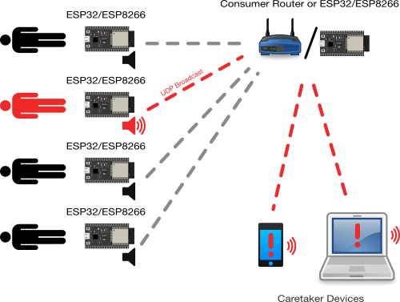

# Ventilator

Ventilator monitor prototype.

### Setup

#### Sensor Programming

Connect a new ESP32 via USB and run the following commands to flash firmware and upload the program

    cd esp
    pip install -r requirements.txt
    make upload_micropython
    make upload
     
#### Running the GUI

    cd gui
    pip install -r requirements.txt
    python3 main.py

### Parts List

Costs are for orders of 1pc.

- ESP32 - $4
  - alternatively, [ESP8266](https://www.ebay.com/itm/5X-ESP8266-ESP-12E-802-11n-WIFI-USB-Development-Board-Arduino-MicroPython-5-Pack/132532596048?hash=item1edb8eed50:g:Z3QAAOSwsnVdyOf-)
- [Buzzer](https://www.digikey.com/product-detail/en/cui-devices/CMI-1295-0585T/102-CMI-1295-0585T-ND/10326184)
  - [other options](https://www.digikey.com/products/en/audio-products/alarms-buzzers-and-sirens/157?k=buzzer&k=&pkeyword=buzzer&sv=0&sf=0&FV=1398%7C358549%2C-8%7C157%2Cmu5V%7C2079&quantity=1&ColumnSort=1000011&page=1&pageSize=25)
- 10k resistor
- Micro USB charger
