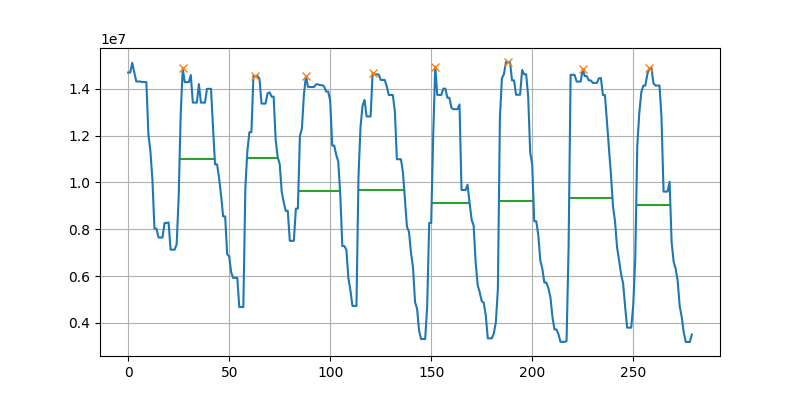

# Computing tidal volume from audio

Here I compute tidal volume by measuring inspiration time and multiplying by 2/3, the flow rate in L / s.

For `audio.wav`, I get a tidal volume estimate of 1.253 with a standard deviation of 0.16.  There are a couple arbitrarily selected parameters in my code that will directly affect the computed tidal volume.  These should be determined through physical experimentation.

#### Computation steps

1. high pass audio at 7KHz
2. take absolute value
3. sum all samples within each 0.1s window, this is a new 10 samp/s waveform
4. minimum filter, window size 3
5. [peak width computation](https://docs.scipy.org/doc/scipy/reference/generated/scipy.signal.peak_widths.html), (need more robust and faster method for micro)

#### Cleaned up signal.  Approximately proportional to flow signal

#### Spectrogram of original audio, and a filtered spectrogram

